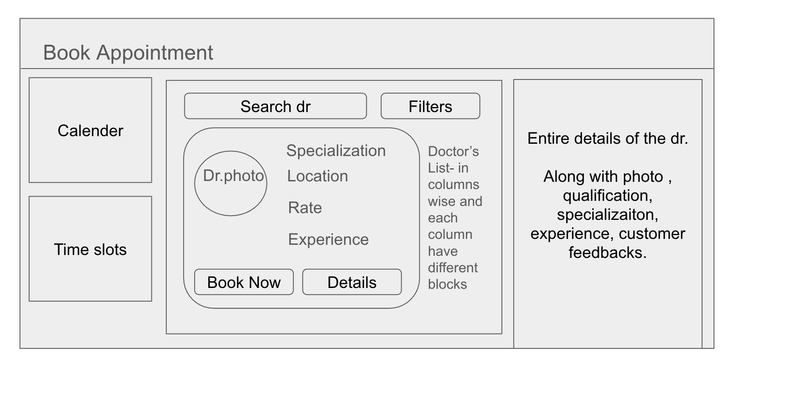
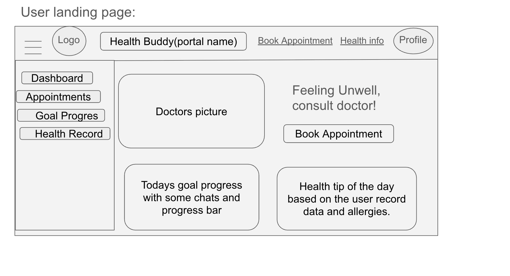
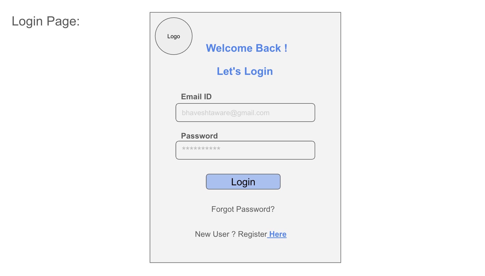
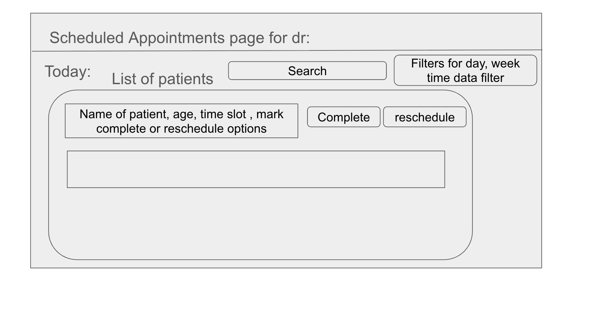
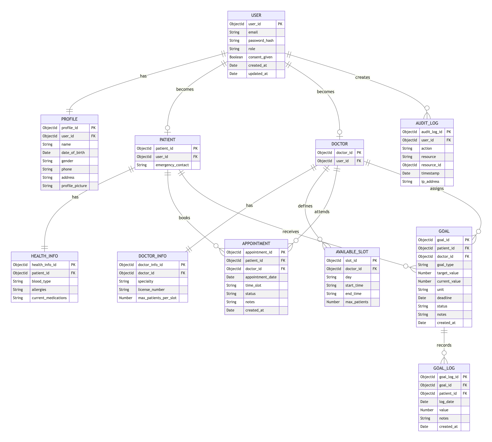
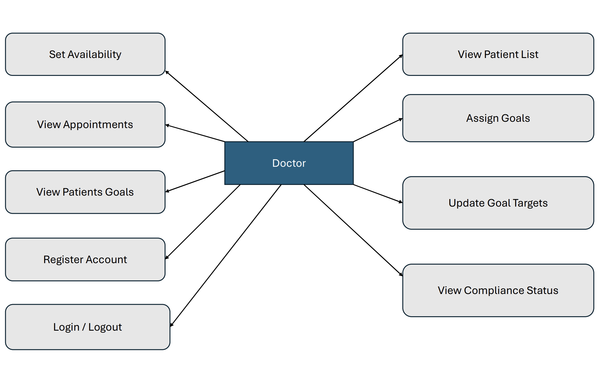
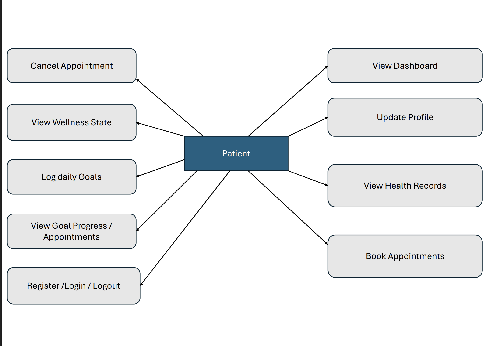
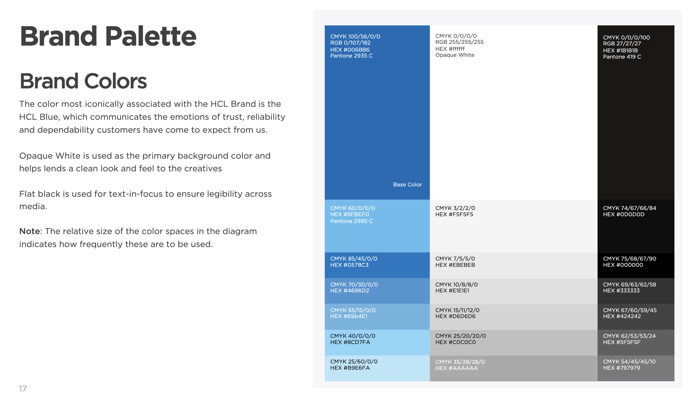
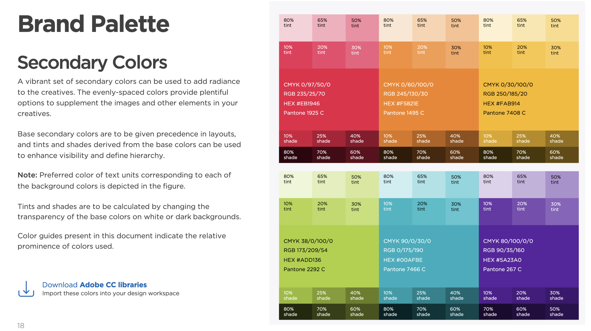

# Healthcare Wellness and Preventive Care Portal

A full-stack healthcare wellness and preventive care portal that seamlessly integrates front-end and back-end technologies to help patients achieve basic health goals and maintain compliance with preventive checkups.

## Technologies Used
- Frontend: React.js
- Backend: Python Django
- Database: MongoDB(NoSQL) using MongoDB Atlas Cloud

## Wireframes

## ER Diagram

## UML Diagrams

### Colour Palette for Frontend
| Primary Colours | Secondary Colours |
|--------|--------|
|  |  |

 from [HCL Brand Colors](https://www.hcl.com/wp-content/uploads/2020/08/HCL-brand-guideline.pdf)

